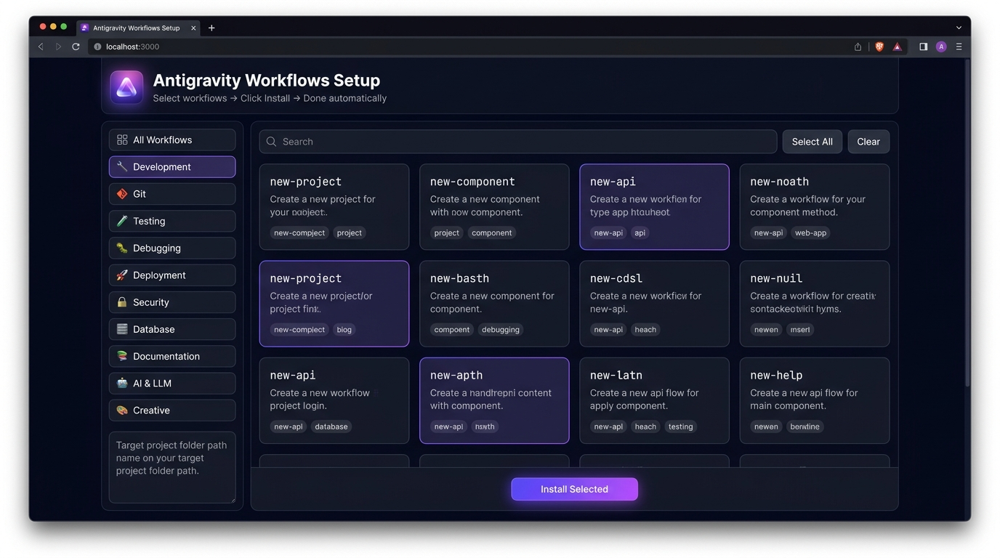

# 🚀 Antigravity Workflows Autopilot

<div align="center">

<!-- Visual Hero Header -->


[](https://github.com/AshrafMorningstar/antigravity-workflows-autopilot/stargazers)
[](LICENSE)
[](https://github.com/AshrafMorningstar/antigravity-workflows-autopilot)
[](https://nodejs.org)
[](CONTRIBUTING.md)

<p align="center">
  <b>⚡ 50+ Stack-Agnostic AI Workflows • 🎯 Visual Dark-Mode Studio • 🛠️ Zero-Config 1-Click Installer • 🤖 Built for Google Antigravity, Claude, Cursor & Gemini</b>
</p>

[Quick Start](#-instant-1-click-quick-start) • [Visual Studio](#-visual-gui-setup-studio) • [Workflows Catalog](#-50-available-workflows) • [Credits & Attribution](#-credits--acknowledgments) • [Contributing](#-contributing)

</div>

---

> [!IMPORTANT]
> **🌟 Credits & Original Authorship**: This project is built upon the incredible foundational work by **[@harikrishna8121999](https://github.com/harikrishna8121999)** and the community in the original [antigravity-workflows](https://github.com/harikrishna8121999/antigravity-workflows) repository. This Autopilot Edition introduces the **1-Click Visual Setup Studio, Dark-Mode Web GUI, Auto-Dependency Resolver, and Real-Time SSE Streaming Installer**. Full credit and deep gratitude to the original creators!

---

## 📸 Visual GUI Setup Studio

Select workflows with checkboxes, set your target project folder, and click **⚡ Install Selected** — no command-line hassle needed!

<div align="center">
  
</div>

---

## 🌟 Why Antigravity Workflows Autopilot?

Modern AI coding agents (like **Google Antigravity, Claude 3.7 / 4.6 Sonnet, Cursor, Gemini Code Assist, and GitHub Copilot**) often make bad assumptions about your tech stack.

**Antigravity Workflows solve this problem permanently:**

- 🔍 **Stack-Agnostic**: Detects your framework (Next.js, Vue, Angular, Django, Go, Rust, FastAPI) first before writing code.
- ❓ **Question-Driven**: Asks clarifying questions instead of hallucinating architecture choices.
- 🎨 **1-Click Visual Studio**: Beautiful web dashboard to search, filter, and install any workflow in seconds.
- ⚡ **Zero Dependencies**: Setup server runs directly on pure Node.js built-ins.
- 📦 **Seamless Integration**: Automatically registers into `.agents/workflows/` or custom targets.

---

## ⚡ Instant 1-Click Quick Start

### Option 1: The Visual Studio (Recommended)

Simply double-click the Windows launcher or run:

```bash
# Windows
start-setup.bat

# Or any platform via Node:
node setup-server.js
```

Your default browser will immediately pop up at **`http://localhost:3737`** with the interactive Dark Mode Dashboard.

---

### Option 2: Command Line (Fast Terminal Mode)

You can also use the CLI directly:

```bash
# Install specific workflows
npx antigravity-workflows install new-project git-commit unit-test

# Install an entire category
npx antigravity-workflows install --category development
npx antigravity-workflows install --category git

# Install ALL 50+ workflows in one shot
npx antigravity-workflows install --all
```

---

## 📦 50+ Available Workflows

<details open>
<summary><h3>🔧 Development & Architecture</h3></summary>

| Workflow | Description | Command |
|----------|-------------|---------|
| `new-project` | Scaffold any project with detected or chosen stack | `/new-project` |
| `new-component` | Create reusable UI components for any framework | `/new-component` |
| `new-api` | Create API endpoints for any backend (REST, GraphQL) | `/new-api` |
| `new-feature` | Full feature lifecycle from design to deployment | `/new-feature` |
| `nextjs-app` | Create modern Next.js applications with best practices | `/nextjs-app` |
| `library` | Create publishable packages and libraries (npm, PyPI) | `/library` |
| `refactor` | Improve code quality, extract functions, clean debt | `/refactor` |
| `migrate` | Modernize tech stacks (JS to TS, framework upgrades) | `/migrate` |
| `cli-tool` | Build command-line applications with argument parsing | `/cli-tool` |

</details>

<details open>
<summary><h3>🔀 Git & Team Collaboration</h3></summary>

| Workflow | Description | Command |
|----------|-------------|---------|
| `git-commit` | Generate conventional commits from staged changes | `/git-commit` |
| `git-pr` | Generate comprehensive, review-ready pull request descriptions | `/git-pr` |
| `git-conflict` | Resolve merge conflicts with context-aware suggestions | `/git-conflict` |
| `git-rebase` | Interactive rebase assistance for clean git history | `/git-rebase` |

</details>

<details open>
<summary><h3>🧪 Testing & Quality Assurance</h3></summary>

| Workflow | Description | Command |
|----------|-------------|---------|
| `unit-test` | Generate unit tests with detected testing framework | `/unit-test` |
| `e2e-test` | End-to-end browser automation tests | `/e2e-test` |
| `playwright-test` | High-fidelity browser automation tests with Playwright | `/playwright-test` |
| `test-coverage` | Strategically improve test coverage for critical files | `/test-coverage` |
| `code-review` | Comprehensive multi-factor review for security and quality | `/code-review` |

</details>

<details>
<summary><h3>🐛 Debugging & Performance</h3></summary>

| Workflow | Description | Command |
|----------|-------------|---------|
| `debug-error` | Analyze complex stack traces and suggest exact fixes | `/debug-error` |
| `debug-log` | Add strategic logging and telemetry diagnostics | `/debug-log` |
| `performance` | Profile, benchmark, and optimize slow execution paths | `/performance` |

</details>

<details>
<summary><h3>🔒 Security & Hardening</h3></summary>

| Workflow | Description | Command |
|----------|-------------|---------|
| `security-audit` | Deep scan code for vulnerabilities, secrets, and leaks | `/security-audit` |
| `dependency-check`| Audit dependencies for CVEs and suggest safe upgrades | `/dependency-check` |
| `auth-implementation` | Implement robust authentication patterns (OAuth, JWT, Session) | `/auth-implementation` |

</details>

<details>
<summary><h3>🚀 Deployment & DevOps</h3></summary>

| Workflow | Description | Command |
|----------|-------------|---------|
| `deploy` | Deploy applications across platforms (AWS, GCP, Vercel, Docker) | `/deploy` |
| `docker` | Containerize applications with multi-stage Dockerfiles | `/docker` |
| `ci-cd` | Set up automated CI/CD pipelines (GitHub Actions, GitLab) | `/ci-cd` |
| `railway-deploy` | Deploy cloud applications directly to Railway | `/railway-deploy` |
| `vercel-deploy` | Configure and deploy frontend applications to Vercel | `/vercel-deploy` |
| `env-config` | Securely manage environment variables and secrets | `/env-config` |

</details>

<details>
<summary><h3>🗄️ Database & Schemas</h3></summary>

| Workflow | Description | Command |
|----------|-------------|---------|
| `db-schema` | Design production database schemas (SQL, Prisma, Drizzle) | `/db-schema` |
| `db-migrate` | Generate and execute safe zero-downtime migrations | `/db-migrate` |
| `db-seed` | Generate realistic seed and mock test data | `/db-seed` |

</details>

<details>
<summary><h3>🤖 AI, LLM & Agent Engineering</h3></summary>

| Workflow | Description | Command |
|----------|-------------|---------|
| `prompt-engineering` | Design, benchmark, and optimize LLM system prompts | `/prompt-engineering` |
| `rag-pipeline` | Build retrieval-augmented generation pipelines | `/rag-pipeline` |
| `ai-agent` | Create autonomous agents with custom tools and memory | `/ai-agent` |
| `workflow-creator` | Meta-workflow to design new Antigravity workflows | `/workflow-creator` |

</details>

<details>
<summary><h3>🎨 Creative, UI & Frontend</h3></summary>

| Workflow | Description | Command |
|----------|-------------|---------|
| `landing-page` | Build high-converting, modern landing pages | `/landing-page` |
| `dashboard-ui` | Create responsive, production-ready admin dashboards | `/dashboard-ui` |
| `design-system` | Create and audit design tokens and component systems | `/design-system` |
| `email-template` | Generate bulletproof, responsive HTML/MJML emails | `/email-template` |

</details>

---

## 🎯 The 5 Core Principles

| # | Principle | Description |
|---|-----------|-------------|
| 1 | **Stack-Agnostic** | Never hardcode assumptions. Detects tools from `package.json`, configs, and file structure. |
| 2 | **Question-Driven** | Clarifies ambiguities upfront to prevent costly rework. |
| 3 | **Progressive Disclosure** | Loads minimal context first, expanding only as needed. |
| 4 | **Single Responsibility** | Each workflow focuses on doing exactly one job flawlessly. |
| 5 | **Composable** | Workflows chain together naturally to solve end-to-end problems. |

---

## 📁 Where Do Workflows Live?

Workflows are installed into `.agents/workflows/` (or `.agent/workflows/`) inside your project directory:

```
your-awesome-project/
├── .agents/
│   └── workflows/
│       ├── new-project.md
│       ├── git-commit.md
│       ├── unit-test.md
│       └── ...
└── src/
```

Antigravity automatically discovers all `.md` files in this folder and registers them as slash commands (`/git-commit`, `/new-component`, etc.) in your chat interface!

---

## 🤝 Credits & Acknowledgments

We stand on the shoulders of giants. This repository builds upon:

- **Original Author**: [**@harikrishna8121999**](https://github.com/harikrishna8121999) — creator of [antigravity-workflows](https://github.com/harikrishna8121999/antigravity-workflows)
- **Community Workflows**: The open-source contributors defining the future of AI-assisted engineering
- **Google Antigravity Team**: For revolutionizing the autonomous coding agent paradigm
- **Maintainer & Autopilot Studio Creator**: [**Ashraf Morningstar**](https://github.com/AshrafMorningstar)

---

## 📄 License

Licensed under the **Apache License, Version 2.0**. See [LICENSE](LICENSE) for full details.

---

<div align="center">

**⭐ If this tool saves you time, consider dropping a Star on GitHub! ⭐**

*Built with ❤️ for the global AI Agent & Antigravity developer community.*

</div>
