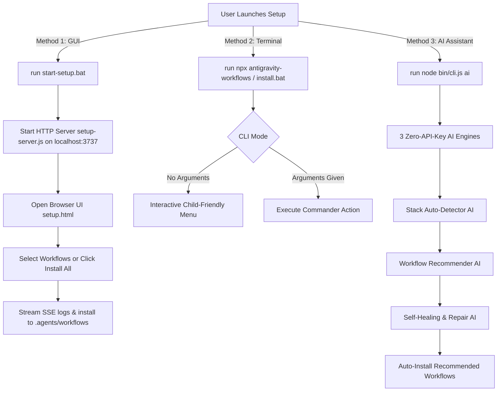

# 06 Detailed Application Flow & State Machine — Antigravity Workflows Autopilot

```mermaid
flowchart TD
    A[User Launches Setup] -->|Method 1: GUI| B[run start-setup.bat]
    A -->|Method 2: Terminal| C[run npx antigravity-workflows / install.bat]
    A -->|Method 3: AI Assistant| D[run node bin/cli.js ai]

    B --> E[Start HTTP Server setup-server.js on localhost:3737]
    E --> F[Open Browser UI setup.html]
    F --> G[Select Workflows or Click Install All]
    G --> H[Stream SSE logs & install to .agents/workflows]

    C --> I{CLI Mode}
    I -->|No Arguments| J[Interactive Child-Friendly Menu]
    I -->|Arguments Given| K[Execute Commander Action]

    D --> L[3 Zero-API-Key AI Engines]
    L --> M[Stack Auto-Detector AI]
    M --> N[Workflow Recommender AI]
    N --> O[Self-Healing & Repair AI]
    O --> P[Auto-Install Recommended Workflows]
```
